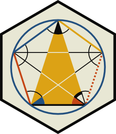
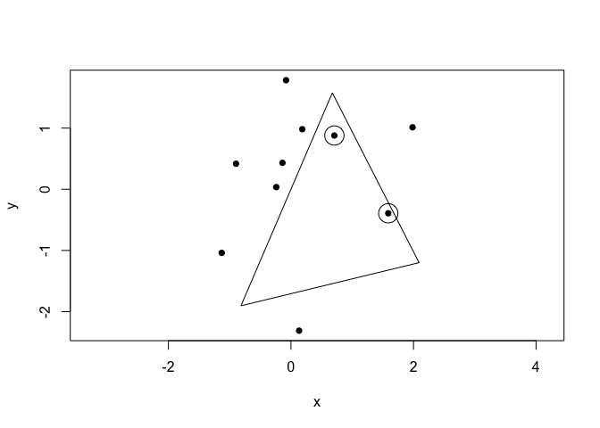

<!-- README.md is generated from README.Rmd. Please edit that file -->

# euclid <a href='https://euclid.data-imaginist.com'></a>

<!-- badges: start -->

[](https://codecov.io/gh/thomasp85/euclid?branch=master)
[](https://github.com/thomasp85/euclid/actions)

<!-- badges: end -->

The purpose of euclid is to provide a new unified foundation for
computational geometry in R. It provides new data types for common low
level geometric concepts such as lines, planes, points, triangles, etc.
as well as a core of functionality relates to these primitives.
Specialised geometric algorithms are intended to extend this package so
that e.g. Tessellation will live in it’s own package but use the
foundation laid out in euclid.

At its core euclid is an interface to the CGAL library for computational
geometry. More specifically, it provides access to the functionality in
the [2D and 3D Linear Geometry
Kernel](https://doc.cgal.org/4.14.3/Kernel_23/index.html). The CGAL
foundation means that computations with euclid are exact and free of the
imprecision attached to working with floating point numbers. This is
very important for geometry since floating point errors can compound and
lead to failures in geometric predicates at the core of many geometric
algorithms. To achieve this, data in euclid is never converted to R data
structures but remain as pointers to CGAL structures unless specifically
converted to numerics (in which case the floating point world kicks in)

## Installation

For now, euclid can be installed from github using remotes:

``` r
# install.packages("remotes")
remotes::install_github("thomasp85/euclid")
```

## Data types

The core of euclid is a set of new primitive vector types that model 2
and 3 dimensional geometric objects. The following types are present:

### 2 and 3 dimensions

  - Circles

  - Directions

  - Lines

  - Points

  - Weighted Points

  - Rays

  - Segments

  - Triangles

  - Vectors

### 2 dimensions

  - Iso rectangles

### 3 dimensions

  - Iso cubes

  - Planes

  - Spheres

  - Tetrahedrons

### Special vector types

In addition to the geometric data types, euclid also provides these
primitive vector types:

  - Exact numerics

  - Bounding boxes

  - Affine transformation matrices

## Example

The following example shows how to work with the different data types:

``` r
library(euclid)

# Construct some exact numbers
random_num <- exact_numeric(rnorm(20))

# Exact numbers behave much like R numerics (though not everything is possible)
random_num[1:5]
#> <exact numerics [5]>
#> [1] -0.89691455  0.18484918  1.58784533 -1.13037567 -0.08025176
max(random_num)
#> <exact numerics [1]>
#> [1] 1.984474
random_num[2] * 10
#> <exact numerics [1]>
#> [1] 1.848492
random_num[5] + random_num[16]
#> <exact numerics [1]>
#> [1] -2.391321
sum(random_num)
#> <exact numerics [1]>
#> [1] 3.909221

# With exact numbers we can construct our geometries
p <- point(random_num[1:10], random_num[11:20])
p
#> <2D points [10]>
#>  [1] <x:-0.897, y:0.418> <x:0.185, y:0.982>  <x:1.59, y:-0.393> 
#>  [4] <x:-1.13, y:-1.04>  <x:-0.0803, y:1.78> <x:0.132, y:-2.31> 
#>  [7] <x:0.708, y:0.879>  <x:-0.24, y:0.0358> <x:1.98, y:1.01>   
#> [10] <x:-0.139, y:0.432>

# Create a line based on a vector, going through the origin
l <- line(point(0, 0), vec(3, 7))

# Which points lies on the positive side of the line?
p %is_on_positive_side% l
#>  [1]  TRUE  TRUE FALSE  TRUE  TRUE FALSE FALSE  TRUE FALSE  TRUE

# Project points to line
p1 <- project(p, l)

# Do the projected points lie on the line?
p1 %is_on% l
#>  [1] TRUE TRUE TRUE TRUE TRUE TRUE TRUE TRUE TRUE TRUE

# Construct a triangle from a random point to the extremes of the projected points
t <- triangle(point(rnorm(1), rnorm(1)), min(p1), max(p1))
t
#> <2D triangles [1]>
#> [1] [<x:2.09, y:-1.2>, <x:-0.816, y:-1.9>, <x:0.675, y:1.57>]

# Which points lies inside the triangle?
p %is_inside% t
#>  [1] FALSE FALSE  TRUE FALSE FALSE FALSE  TRUE FALSE FALSE FALSE

# Visualise result
plot(p, pch = 16)
euclid_plot(t)
euclid_plot(p[p %is_inside% t], cex = 3)
```



``` r

# Area of t (cannot be given exact for all geometries so is returned as numerics)
approx_area(t)
#> [1] -4.531123
```

## Code of Conduct

Please note that the euclid project is released with a [Contributor Code
of
Conduct](https://contributor-covenant.org/version/2/0/CODE_OF_CONDUCT.html).
By contributing to this project, you agree to abide by its terms.
